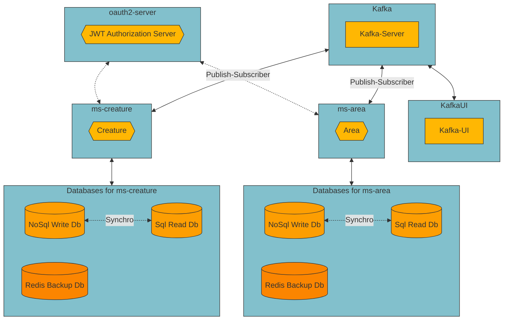

# nano-bestiary

Microservices development for managing your list of preferred mythical beasts. This multimodule Maven project is built with Reactive Programming, Hexagonal Arch, CQRS, Event Sourcing, and Kafka for synchronizing databases. [RSocket](https://rsocket.io/) for communication between microservices and Redis to store relevant information from other components.

:rotating_light::no_entry:** IN CONSTRUCCTION**
- [Kafka](https://kafka.apache.org/) [9092] + [9093] 
- [Kafka-UI](https://docs.kafka-ui.provectus.io/) [8081]
- Eureka server as service registry and discovery service [8761]
- API Gateway with centralized [OpenApi Swagger-UI](https://swagger.io/) [8080] 
- REST API ms-area with [OpenApi Swagger-UI](https://swagger.io/) [0]
- REST API ms-creature with [OpenApi Swagger-UI](https://swagger.io/) [0]
- REST API ms-oauth2 with [OpenApi Swagger-UI](https://swagger.io/) working as JWT Token Authorization Server [9000]




## Table of contents

- [Installation](#installation)
- [Usage](#usage)
- [It's not a bug, it's a feature](#features)
- [Maintainers](#maintainers)
- [License](#license)


## Installation

1. First of all clone or download the project.

1. Inside the main folder, you could find two docker-compose yaml files.

1. From there use the command line to start the project in dev or production mode

```    
    **Developer mode**  
    docker-compose -f docker-compose-dev.yml up -d

    **Production mode**
    docker-compose -f docker-compose-prod.yml up -d
```
      
The dev environment is ready for using with your IDE. The microservice attempts to communicate with Kafka using the local host. In production, it uses the archive Dockerfile to build an image of the project, so you wont need the IDE.
   
4. You could stop the project and free resources with any of these orders

```
    **Developer mode**
    docker-compose -f docker-compose-dev.yml down --rmi local -v
      
    **Production mode**
    docker-compose -f docker-compose-prod.yml down --rmi local -v  
```
  
   
## Usage

First of all, please visit the centralized REST API documentation on the Api-Gateway server. You can change the selection on the upper dropdown menu.

    http://localhost:8080/swagger-ui.html
    
In this context, unexpected behavior may occur due to the different network settings when using Swagger requests directly from Api-Gateway centralized Swagger-UI. To prevent some of these issues, CORS and CSRF have been disabled in Spring Security settings. Alternatively if you want use the Swagger-UI dashboard for REST operations, it is recommended to call the microservice directly:

    http://localhost:${port}/swagger-ui.html.
  
API Rest Endpoints have dynamic ports but Api Gateway responds on 8080 port, so you could use a program like SoapUI or Postman and call them with the following nomenclature http://${hostname}:8080/api/v1/${entity}. For instance:

```
    ** Get a List of areas **
		http://localhost:8080/api/v1/areas

	**  Get a Creature according to an Id **
		http://localhost:8080/api/v1/creatures/22000000-0000-0000-0000-000000000003
```
   
The initial data load is performed by the kafka-data-init microservice. It uses Kafka to publish events, which the other microservices then use to update their databases.    
  
[Kafka-UI](https://docs.kafka-ui.provectus.io/) allow you to check your [Kafka](https://kafka.apache.org/) server using a practical dashboard, so visit the following url:

    http://localhost:8081

A good way for checking the JWT generation and validation flow, is to review **[this article](https://adictosaltrabajo.com/2023/06/29/securizacion-aplicacion-oauth-2-spring-authorization-server-spring-resource-server/)**. A key difference in my development is that you can register a user using the same microservice at **http://localhost:9000/register**. Here is an example of the info you need to send:

```
{
	"name":"Nico",	
	"lastname":"Macguffin",	
	"email":"nMacguffin@dom.eu",
	"password":"passpasspass"
}
```

If you want to test the project in a Kubernetes environment, you can use the contents of k8s-manifest folder. The manifests are configured for development profile, so you need your IDE to deploy the microservice infrastructure. You can run all manifest files with:

    kubectl -apply ./k8s-manifest
    

## Features

#### :arrow_forward: Unit testing for business logic classes using Test Containers for Repositories

#### :arrow_forward: Hexagonal Architecture and CQRS with independent databases

#### :arrow_forward: Redis DB for each microservice works as caches to store ID references for other REST APIs

#### :arrow_forward: Event Sourcing for persisting as an ordered sequence of events

#### :arrow_forward: Use of RSocket for request communication between microservices 


## Maintainers

Just me, [Iván](https://github.com/Ivan-Montes) :sweat_smile:


## License

[GPLv3 license](https://choosealicense.com/licenses/gpl-3.0/)


---


[](https://www.java.com/es/)
[](https://https://maven.apache.org/)
[](https://spring.io)
[](https://github.com)
[](https://https://eclipse.org/)
[](https://www.sonarsource.com/products/sonarqube/downloads/)
[](https://www.docker.com/)
[](https://kafka.apache.org/)
[](https://choosealicense.com/licenses/gpl-3.0/)
